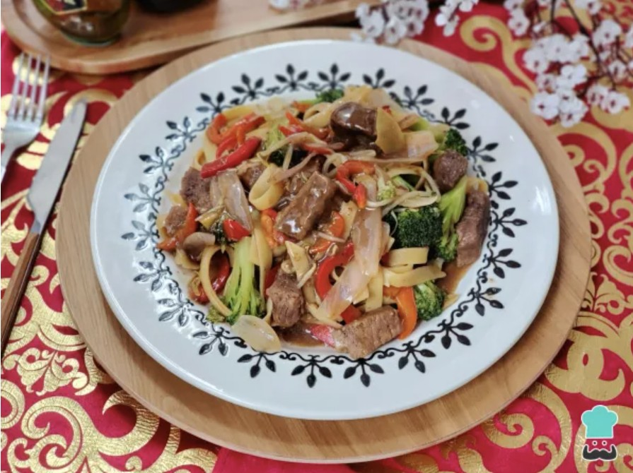

# 🍜 Receta de Tallarín Saltado Chifa

---

## 📌 Introducción
El **tallarín saltado chifa** es una deliciosa fusión de la gastronomía china y peruana, surgida de la influencia de los inmigrantes chinos en el Perú. Este platillo es un clásico de los **chifas**, restaurantes que se especializan en esta combinación culinaria. Con esta receta, podrás prepararlo fácilmente en casa y disfrutar de su exquisito sabor.

### 📋 Información de la Receta
- 🍽️ **Raciones**: 2 comensales
- ⏳ **Tiempo de preparación**: 30 minutos
- 🔥 **Dificultad**: Baja

---

## 🛒 Ingredientes

- 🥩 **400 g de lomo de res** o pechuga de pollo
- 🫚 **1 trozo de kion (jengibre)**
- 🧄 **2 dientes de ajo**
- 🌶️ **1 pimiento rojo**
- 🫛 **1 puñado de holantao (vainitas chinas)**
- 🧅 **1 cebolla**
- 🥦 **½ brócoli**
- 🍜 **¼ paquete de tallarines chinos**
- 🌿 **Aceite de sésamo (cantidad necesaria)**
- 🌿 **Sillao (salsa de soja, cantidad necesaria)**
- 🥄 **2 cucharadas de salsa de ostión**
- 🥄 **1 cucharón de caldo de res o de ave**
- 🧂 **Sal al gusto**

---

## 🍳 Preparación paso a paso

### 1️⃣ Preparación de la proteína
🔪 Corta el **lomo de res** o la **pechuga de pollo** en tiras de aproximadamente **2 cm de grosor** y luego en **cubos alargados**. Sazónalos con **pimienta negra** y un buen chorro de **sillao**. Reserva.

### 2️⃣ Preparación de los vegetales
🍽️ Pela y corta el **kion** y los **ajos** en finas láminas. Corta la **cebolla** en gajos y el **pimiento rojo** en juliana. Reserva por separado.

### 3️⃣ Blanquear el brócoli
🥦 Corta el brócoli en racimos pequeños y blanquéalos en agua hirviendo por **3 minutos**. Luego pásalos por **agua fría** para detener la cocción.

### 4️⃣ Cocción de los tallarines
🍜 Hierve agua con sal y cocina los **tallarines chinos** hasta que estén **al dente**. Escúrrelos y mézclalos con **aceite de ajonjolí** para evitar que se peguen.

### 5️⃣ Salteado de la carne
🔥 En un **wok bien caliente**, añade aceite y sella la carne hasta que tome color. Si deseas, puedes flambear con un toque de **pisco** para darle un sabor especial. Reserva.

### 6️⃣ Salteado de los vegetales
🧄 En el mismo wok, añade **aceite de sésamo** y saltea el ajo y el kion hasta que liberen su aroma. Agrega la **cebolla**, el **pimiento rojo** y el **holantao**, y sofríe durante un par de minutos.

### 7️⃣ Integración final
🥢 Incorpora el **brócoli**, la **carne** y los **tallarines** al wok. Añade **sillao, salsa de ostión y caldo de res o ave**. Ajusta la sal y saltea todo bien.

### 8️⃣ Servir y disfrutar
🍽️ Mezcla bien, rectifica la sazón y sirve caliente. ¡Disfruta de este **auténtico tallarín saltado chifa** casero! 🤤

---

## ¡Buen provecho! 🍜🥢

